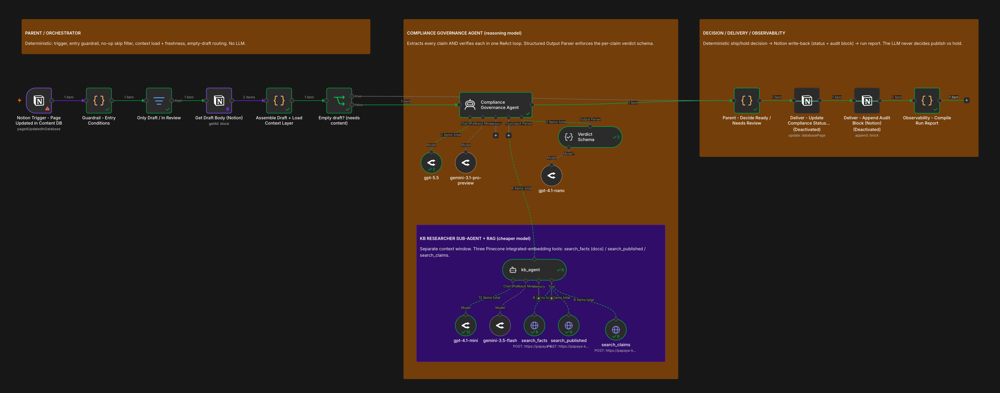

# Compliance Governance Gate (n8n)

An agent-in-the-loop compliance gate for a payroll/EOR company's marketing content: a marketer writes a draft, the agent audits every checkable claim against approved evidence before it can go out under the company's name. It never publishes — it only categorizes risk and hands the human reviewer a fast triage.

Built for Papaya Global's AI GTM Engineer home assignment (Part 3).

## Why this and not a content generator

The obvious build is "AI writes, human approves." This flips it: the human writes, the *agent* is the gate. For a company whose pitch is "we own the liability" across 160+ jurisdictions, the risk that matters isn't clumsy AI copy — it's *anyone* (PMM, freelancer, agency) publishing a claim that's stale, contradicts a prior post, or overreaches on compliance. One component, one clear contract, testable in isolation.

## Structure

```
Notion Trigger (page → Draft)
  → deterministic entry guardrails + freshness check
  → Compliance Governance Agent (gpt-5.5, gemini-3.1-pro-preview fallback)
        ├─ Structured Output Parser (per-claim verdict schema; gpt-4.1-nano auto-fixer)
        └─ kb_agent sub-agent (gpt-4.1-mini, gemini-3.5-flash fallback)
              ├─ search_facts       (Pinecone: verified fact layer)
              ├─ search_published   (Pinecone: Papaya's own published posts)
              └─ search_claims      (Pinecone: approved/banned canonical claims)
  → deterministic ready/needs-review decision
  → Notion write-back (Compliance Status + audit block)
```

Three boxes: **deterministic guardrails** → **agent + RAG sub-agent** → **deterministic decision + write-back**. The LLM never decides publish vs. hold — that arithmetic is plain JS.

## The risk taxonomy

Every flagged claim gets a `risk_category`, not just a pass/fail: `hallucinated_fact`, `stale_figure`, `banned_claim`, `contradicts_prior_publication`, `contradicts_approved_claim`, `jurisdiction_overreach`, `liability_language`. A reviewer sees *what kind* of risk, not just that something's wrong. Full taxonomy + prompts in [`prompts.md`](prompts.md).

## Three sources of truth

1. **Fact context layer** — a compiled, source-tagged markdown file of verified company facts, embedded in the workflow. Catches hallucinations, stale figures, banned claims.
2. **Published-content RAG** (Pinecone) — the company's own recent posts. Catches a draft that contradicts what was already said publicly.
3. **Approved/banned canonical claims** (Pinecone) — positive and negative exemplars in one namespace, so the gate knows both what's safe to say and what it must never say.

Full design rationale in [`DESIGN.md`](DESIGN.md).

## Import + credentials

Import [`compliance-governance-gate.n8n.json`](compliance-governance-gate.n8n.json), then set:

| Node(s) | Credential |
|---|---|
| `Notion Trigger…`, both `Deliver…` nodes, `Get Draft Body` | Notion (`notionApi`) |
| `gpt-5.5`, `gpt-4.1-mini`, `gpt-4.1-nano`, `gemini-3.5-flash`, `gemini-3.1-pro-preview` | OpenRouter (`openRouterApi`) |
| `search_facts`, `search_published`, `search_claims` | Pinecone (`pineconeApi`) |

Set the Notion Trigger's `databaseId` (placeholder: `SET_DATABASE_ID_AT_IMPORT`). Seed the three Pinecone namespaces with the scripts in [`pinecone/`](pinecone) (each reads `PINECONE_API_KEY` from the environment — no key is hardcoded).

**How to test:** [`LIVE-TEST.md`](LIVE-TEST.md) — four fixtures with expected verdicts, including the catch a fact-only build can't make (a draft price that's internally plausible but contradicts a prior published post).

## Reproducibility

The workflow JSON is generated by [`generate_governance_gate_agent.py`](generate_governance_gate_agent.py) — the node graph, prompts, and schema are defined in code, not hand-clicked.

## Honest tradeoffs

- **No dry-run for the agent stage.** A native AI Agent's ReAct loop can't be dry-run the way plain HTTP+Code stages can — the deterministic nodes and the Pinecone RAG path are verified without live calls; the agent itself is tested live against the fixtures.
- **Coarser observability.** Per-stage token/cost is nested inside the agent's execution metadata rather than logged as a clean per-stage row. Accepted for the cleaner two-agent structure; a production tap would emit the nested usage to a telemetry store.

## Screenshot


